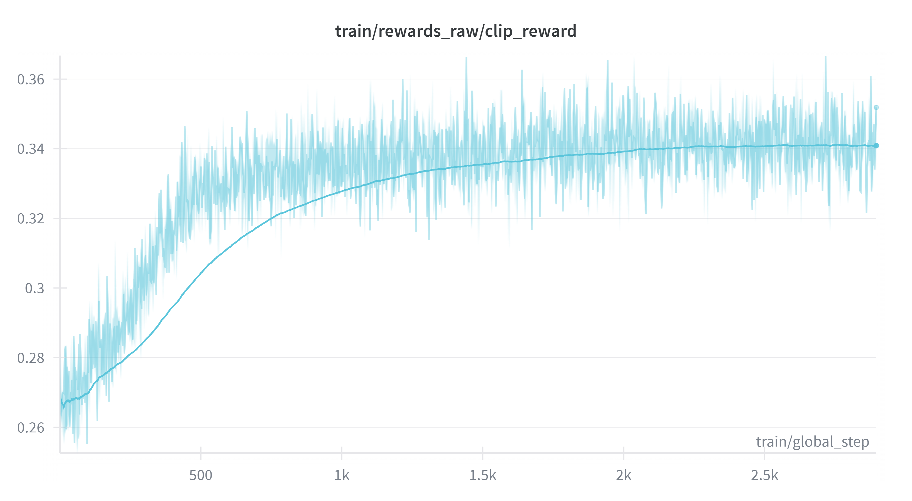
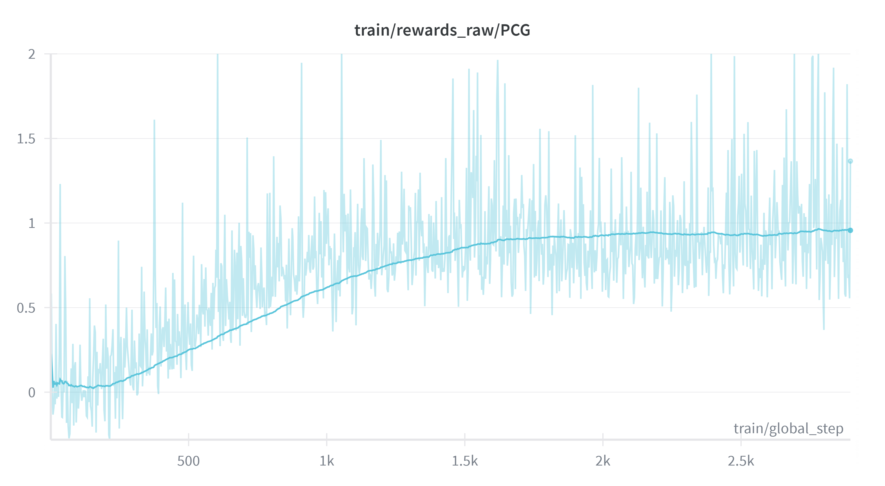
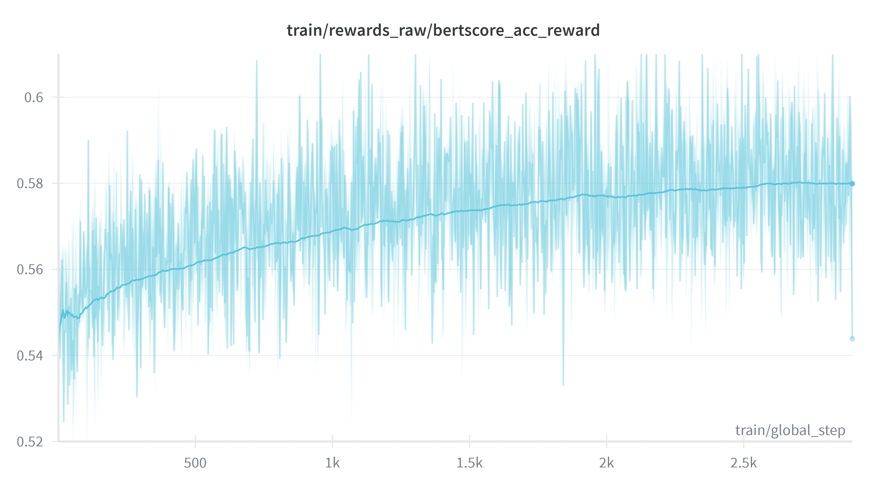

# Code for [Reward-Decomposed Reinforcement Learning for Immersive Video Role-Playing]

## 🛠️ Environment Setup

This project is developed within the `ebm-rl` environment. To ensure consistent results, please follow the setup instructions below.

**Installation Steps:**  
Navigate to the project root and create the environment:
```bash
# Option A: Full replication via YAML
conda env create -f environment.yml
conda activate ebm-rl

# Option B: Minimal install via requirements.txt
pip install -r requirements.txt
```
## 🏗️ Dataset Construction
The construction of the Immersive-Video-RP dataset involves two main phases: Sample Generation from Original Movie Dialogues (Script-Grounded) and LLM-Augmented Dialogue Expansion.

To ensure clarity and maintainability, the dataset construction tools are managed in a separate repository. For the detailed implementation of the data generation and augmentation pipeline, please refer to our dedicated repository: 👉 [Dataset Construction Toolkit](https://anonymous.4open.science/r/Generate-Immersive-RP-video-dataset-Tool).

This specialized toolkit includes:
* Script-Grounded Sample Generation: The core logic for extracting and aligning high-quality dialogue snippets from raw movie scripts and video segments.

* LLM-Augmented Expansion: The prompting engineering and filtering logic used to enrich dialogue history while maintaining persona consistency.


## 🚀 Train Model
### Stage-1: CoT SFT cold-start phase

To mitigate format collapse and initialize the model with "See-Think-Speak" reasoning capabilities, execute the cold-start training script:

```bash
# Launch script for the CoT SFT cold-start phase
bash ./src/scripts/RP_COT_SFT.sh
```

### Stage-2: "See-Think-Speak" RL(GRPO) phase
To initiate the Reinforcement Learning (RL) training, execute the provided script below. The core EBM-RL training logic is implemented in [`src/r1-v/src/open_r1/RP_RL.py`](./src/r1-v/src/open_r1/RP_RL.py).

```bash
# Launch script for the EBM-RL phase
bash ./src/scripts/EBM_RP_RL.sh
```
Please note the following configurations for the CLIP-based Scene–Text Alignment Reward module:

* **CLIP-MAX Method**: Replace the reward calculation script with `src/open_r1/clip_MAX_server.py`.

* **CLIP-SentTopK Method**: Replace the reward calculation script with `src/open_r1/clip_Topk_server.py`.

## 📈 RL Training Curves
The following curves demonstrate the performance of the three core reward components during the EBM-RL phase: CLIP-based Alignment,PCG-based Reasoning Consistency and BERTScore-based Accuracy.

<table align="center" cellspacing="0" cellpadding="0" style="border-collapse: collapse;">
  <tr>
    <td align="center" valign="bottom" style="padding: 0;">
      
      <br /><b>CLIP Reward</b>
    </td>
    <td align="center" valign="bottom" style="padding: 0;">
      
      <br /><b>PCG Reward</b>
    </td>
    <td align="center" valign="bottom" style="padding: 0;">
      
      <br /><b>BERTScore Reward</b>
    </td>
  </tr>
</table>


## 📊 Inference and Metric Evaluation for Immersive-Video-RP
After completing the RL training, you can perform inference using the trained model checkpoint to verify the performance.
### Inference
Execute the provided inference script to generate responses from the RL-trained model. This script supports multi-GPU sharding to accelerate the process.

```bash
# Launch inference for the RL-trained model
bash ./src/RP_Inference_and_rate/RP_inference.sh
```

### Evaluation
After completing the inference phase for all candidate models, use the automated critic system to perform comparison. This phase leverages a strong LLM as a judge to provide both quantitative scores and qualitative justifications.

#### Evaluation Methodology:
To ensure absolute objectivity and prevent "model-name bias" during the judging process, our framework employs a Masked Identity Mechanism:

* **Blind Review:** Model names are masked with anonymous labels (e.g., Model A, Model B) before the prompt is sent to the LLM Judge.

* **Automatic Mapping:** Once the judge returns the scores and reasoning, the system automatically maps the results back to the original model identities.

* **Comprehensive Reporting:** The script generates a consolidated JSON report containing aggregate statistics, individual sample scores, and the specific reasoning for every model's response.

#### **Running the Evaluation:**   
Navigate to the evaluation directory `cd src/RP_Inference_and_rate` and execute the evaluation script. This script allows for the simultaneous evaluation and comparison of all model scores on a specific metric.

```bash
# Run the evaluation script
python Immersive-Video-RP-evaluate.py \
  --models \
    Intervl-38B=./Inference_result/InternVL3_5-38B-Instruct-infer-result.json \
    Qwen-32B=./Inference_result/Qwen2.5-VL-32B-infer-result.json \
    Intervl-14B=./Inference_result/InternVL3_5-14B-infer-result.json \
    Intervl-8B=./Inference_result/InternVL3_5-8B-infer-result.json \
    Qwen-7B=./Inference_result/Qwen2.5-VL-7B-Instruct-infer-result.json \
    RoleMRC=./Inference_result/Qwen2.5-7B-RoleMRC-dpo-infer-result.json \
    Crab=./Inference_result/Crab-infer-result.json \
    Haruhi=./Inference_result/Haruhi-Zero-7B-0_3-infer-result.json \
    Qwen-sft-our-cot=./Inference_result/Qwen2.5-VL-7B-sft-infer-result.json \
    Qwen-EBM-Topk=./Inference_result/Qwen2.5-EBM-Topk-infer-result.json \
    Qwen-EMB-MAX=./Inference_result/Qwen2.5-EBM-MAX-infer-result.json \
  --metric Situational_Persona_Compatibility \
  --output_file ./rate_result/Situational_Persona_Compatibility.json \
  --video_base_dir ../../../simple-subtitling/Processed_Dialogue/RP-EBM-Dataset \
  --limit 1500
  ```
